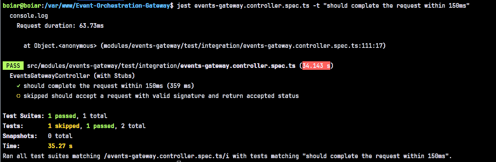
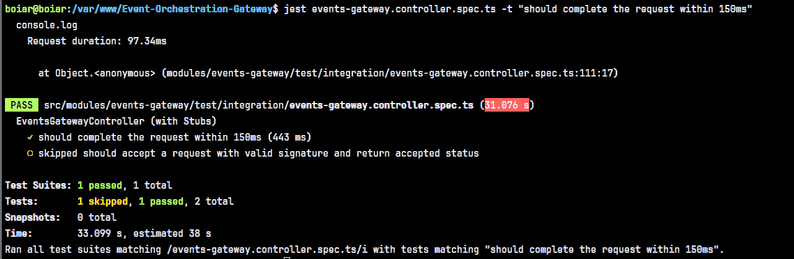
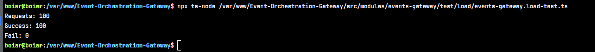

# Resilient Event Orchestration Gateway

## Overview
A **high-concurrency asynchronous event gateway** built with NestJS, designed to act as a resilient buffer between external event producers and internal business logic. The system is engineered to handle massive traffic bursts (e.g., flash sales) with low-latency ingestion and reliable background processing.

---

## Technical Stack

| Technology           | Role                                                      |
|----------------------|-----------------------------------------------------------|
| **Node.js / NestJS** | Core Framework                                            |
| **BullMQ (Redis)**   | Asynchronous Queueing & Flow Control                      |
| **Redis**            | Idempotency Store (Locking) & Job Persistence             |
| **MongoDB**          | Persistent Store for Events and Stateful Data (Shipments) |
| **TypeScript**       | Language for Type Safety and Object-Oriented Design       |
| **Jest**             | Testing                                                   |

---

## Key Features & Architecture

### 1. Low-Latency Ingestion (< 150ms)
The ingestion layer is kept "thin." It validates the HMAC signature of incoming payloads, ensures the request is well-formed, and immediately enqueues the job to Redis. It returns a `202 Accepted` status to the producer, offloading all heavy processing (DB writes, external API calls) to background workers.

### 2. Orchestration & Flow Control
Events are pushed to a BullMQ Redis-backed queue immediately on ingestion. Background workers
consume jobs at a controlled concurrency, preventing system overload regardless of burst size.

### 3. Idempotency & Duplicate Prevention
Courier systems frequently send the same event twice. A triple-layer strategy prevents duplicate processing:
- **BullMQ Deduplication:** The `jobId` is set to `eventId`, preventing duplicate jobs from entering the queue while pending.
- **Short-Term Distributed Locking:** Redis locks with unique UUID tokens and atomic "Compare-and-Delete" Lua scripts ensure thread-safe processing across workers.
- **Durable Persistence:** MongoDB tracks event status (`PENDING`, `PROCESSED`, `FAILED`) to provide a permanent record and fallback check.

### 4. Resilience & Global Observability
The system implements a global exception filter that captures and logs full stack traces for non-HTTP errors (database, external services), ensuring high visibility into production failures.

---
## Challenges & Design Decisions

### 1. Idempotency Layer Position (Entry Point vs Background Worker)

**Problem:**
Initially, the idempotency check (duplicate event prevention) was placed at the entry point — inside `eventsEnqueue` before the event was pushed to the queue. The logic was straightforward: reject duplicates as early as possible before any work is done.

**Issue discovered:**
During performance testing, the Redis lock check at the entry point was adding latency that pushed the response time above the 150ms target. The ingestion layer is supposed to be "thin" — its only job is to acknowledge and offload. Any synchronous blocking operation at this layer, including a Redis call, becomes a bottleneck under high concurrency.

**Solution:**
The idempotency check was moved entirely into `processQueuedEvent` inside the background worker. The entry point now does only two things: validate the HMAC signature and emit the job to the queue. This brought response times consistently below 150ms while keeping duplicate protection intact — just enforced at the right layer.

---

### 2. Redis-Only Idempotency (Durability Concern)

**Problem:**
After moving the lock to the background worker, the first implementation relied solely on Redis to track processed events. A Redis key would be set when processing started and removed on completion.

**Issue discovered:**
Redis is an in-memory store. In the event of a Redis restart or memory pressure, all active lock keys are lost. This means an event that was mid-processing — or already processed — could be picked up again by the worker with no memory of the previous attempt, causing duplicate processing or data corruption.

**Solution:**
A dual-layer idempotency strategy was adopted:

- **Redis** acts as the fast short-term lock — acquired at the start of processing to block concurrent duplicate jobs.
- **MongoDB** acts as the durable long-term record — the event is persisted with a status (`PENDING`, `PROCESSED`, `FAILED`) before any processing begins.
---

### Steps

1. Initialize and setup project
2. Setup Docker and services
3. Create project structure (HMVC)
    - **events-gateway module**
        - Controllers, services, DTOs, repositories
        - HMAC middleware for payload signature validation
        - Redis and db idempotency layer to prevent duplicate event processing
        - BullMQ integration for background job handling (achieves response time performance)
        - Test suite
            - Unit tests for service layer
            - Integration tests for controller
            - Load test — 100 concurrent requests
    - **shared module**
        - Redis provider and service for event deduplication
    - **routing-service module** *(stub — simulates 2s processing delay)*
    - **Global Exception Filter** *(Catches all unhandled exceptions across app)*

---
### Event Processing Flow
```
POST /v1/events-gateway
        |
   HMAC signature validation (HmacMiddleware)
        |
   eventsEnqueue(dto)
        |-- queue.add(jobId = eventId)
        |
   return { status: 'accepted' }       <-- success code to producer
        | 
          
───────────────────────────
     Background Worker               
───────────────────────────

   processQueuedEvent()
        |
   idempotency.acquireLock
        |
   eventRepo.save()                        
        |
   resolveShipment()                            
        |
   check shipment.status === ACTIVE
        |
   callRoutingService()                         
        |
   eventRepo.updateStatus()
        |
   idempotency.releaseLock(lockToken)  

───────────────────────────
     On Failure                
───────────────────────────

   catch(error)
        |
   GlobalExceptionFilter logs full stack trace
        |
   eventRepo.updateStatus()
        |
   idempotency.releaseLock(lockToken)
        |
   throw error                         <-- BullMQ exponential backoff retry
```        |
   BullMQ retries with exponential backoff
        |   attempt 1 -> wait 1s -> re-acquire lock -> try again
        |   attempt 2 -> wait 2s -> re-acquire lock -> try again
        |   attempt 3 -> wait 4s -> re-acquire lock -> try again
        |
   max retries exhausted --> Dead Letter Queue listener

        |
   EventsDlqProcessor logs permanently failed event

```
---
## Dead Letter Queue Strategy
Failed events that exhaust all retry attempts are routed to the `events:dlq` Redis list.
The `EventsDlqProcessor` moves events to this queue after the final retry failure,
logs the permanently failed event with full context (eventId, type, shipmentId),
and removes it from the active processing queue.

## Eventual Consistency
The system is eventually consistent by design. When a producer receives `202 Accepted`,
the event has been queued but not yet processed. The event status in MongoDB transitions
from `PENDING` to `PROCESSED` or `FAILED` asynchronously. Consumers of event state
(such as merchant dashboards) should read status from MongoDB rather than relying on
the synchronous response. Idempotency guarantees that even if the same event is
delivered multiple times, the final state in MongoDB converges to a single outcome.

---
## Quick Start
```bash
docker-compose up --build
```
App runs on `http://localhost:3000`
Api-docs(Swagger): `http://localhost:3000/api-docs` 

---
### Testing

### unit tests
``` bash
npm run test:unit
```

#### Controller test < 150ms time response
```bash
docker exec -it fincart_app npm run test:int
```

#### Integration test < 150ms time response
```bash
docker exec -it fincart_app npm run test:int
```

#### Controller test < 150ms time response
```bash
docker exec -it fincart_app npm run test:perf
```

**Request duration: 63.73ms**


**Request duration: 97.34ms**


#### Load Test — 100 Concurrent Requests
```bash
npx ts-node src/modules/events-gateway/test/load/events-gateway.load-test.ts
```

